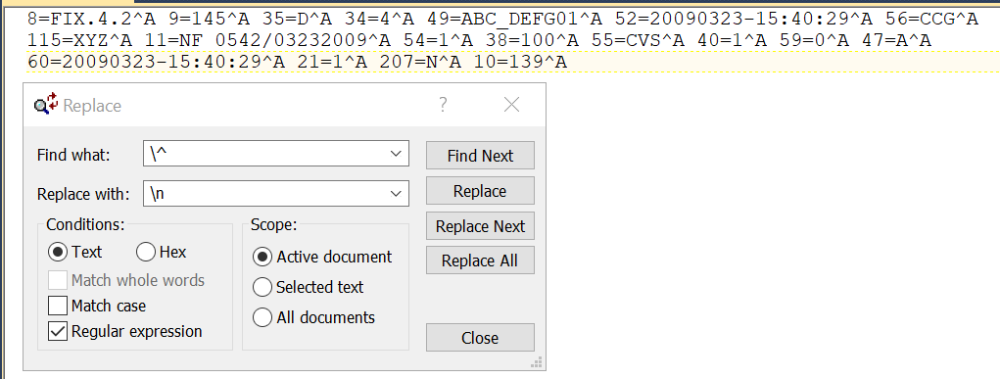

# TextPad Use Cases
## Data formatting
TextPad can be used to format, clean text data. The following data segment can be broken / formatted into multi-line using TexPad

```shell
8=FIX.4.2^A 9=145^A 35=D^A 34=4^A 49=ABC_DEFG01^A 52=20090323-15:40:29^A 56=CCG^A
115=XYZ^A 11=NF 0542/03232009^A 54=1^A 38=100^A 55=CVS^A 40=1^A 59=0^A 47=A^A
60=20090323-15:40:29^A 21=1^A 207=N^A 10=139^A 
```
1. Use the Search -> Replace 
2. Find What: = \^
3. Replace with: = \n
4. Conditions = Regular expressions
5. Click Replace All


