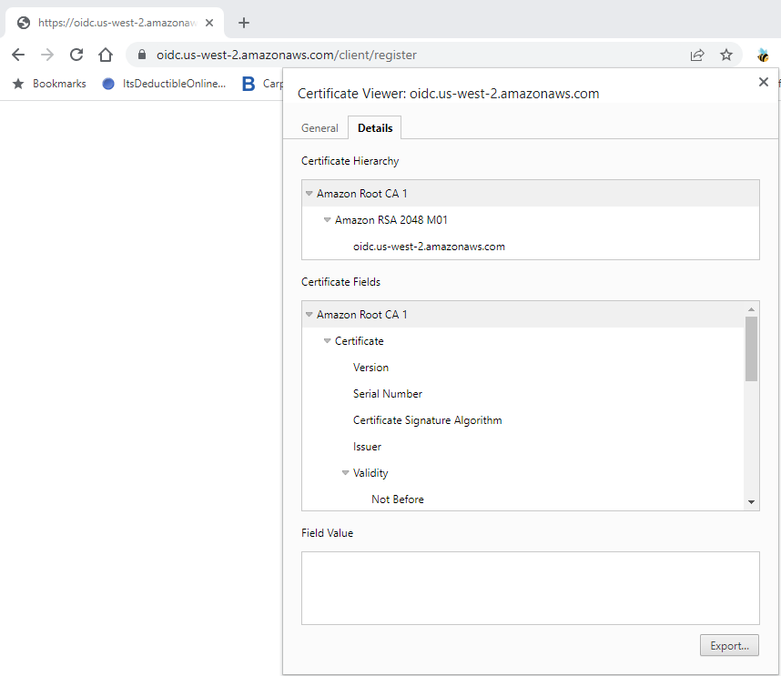
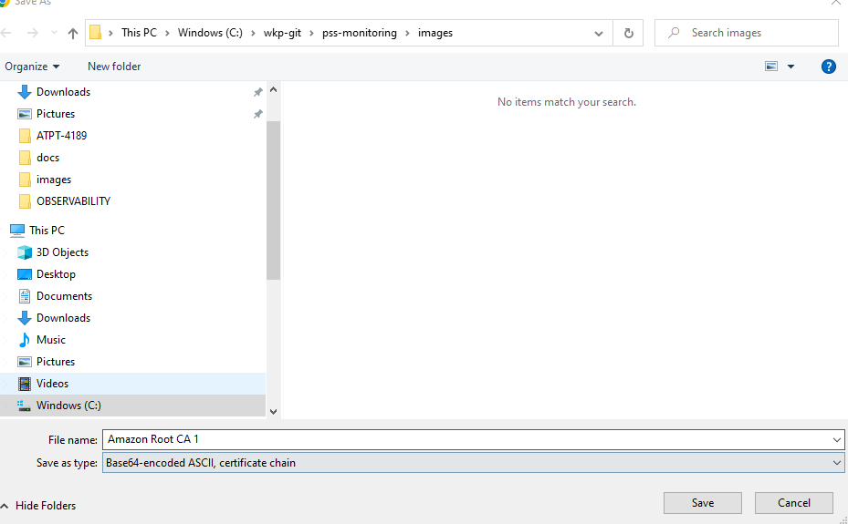

# [AWS SSO Cheatsheet](sso)

# AWS Credentials By Assuming a Role

```bash
export AWS_ROLE_ARN=
export AWS_WEB_IDENTITY_TOKEN_FILE=$(cat /var/run/secrets/tokens/vault-token)                                                  
export $(printf "AWS_ACCESS_KEY_ID=%s AWS_SECRET_ACCESS_KEY=%s AWS_SESSION_TOKEN=%s" \
$(aws sts assume-role-with-web-identity   --role-arn $AWS_ROLE_ARN   \
--role-session-name test   \
--web-identity-token $AWS_WEB_IDENTITY_TOKEN_FILE \
--query "Credentials.[AccessKeyId, SecretAccessKey, SessionToken]" --output text))
aws s3 ls
```

# AWS CLI behind Corporate Firewall
Some times when you try to access aws services using cli, you get the following error message
```bash
aws s3 ls
[SSL: CERTIFICATE_VERIFY_FAILED] certificate verify failed (_ssl.c:581)
```
1. Take the url (https://oidc.us-west-2.amazonaws.com/client/register) open in chrome 
2. Export the root certificate chain as "Base64-encoded ASCII, certificate chain"
3. 
4. 1. export AWS_ROLE_ARN=
2. export AWS_WEB_IDENTITY_TOKEN_FILE=$(cat /var/run/secrets/tokens/vault-token)                                                  
3. export $(printf "AWS_ACCESS_KEY_ID=%s AWS_SECRET_ACCESS_KEY=%s AWS_SESSION_TOKEN=%s" \
$(aws sts assume-role-with-web-identity   --role-arn $AWS_ROLE_ARN   \
--role-session-name test   \
--web-identity-token $AWS_WEB_IDENTITY_TOKEN_FILE \
--query "Credentials.[AccessKeyId, SecretAccessKey, SessionToken]" --output text))
4. aws s3 ls

5. By default AWS CLI uses /C/Users/UserName/Amazon/AWSCLIV2/awscli/botocore/cacert.pem as trust certificate store
6. Add the exported certificate from step #2 to /C/Users/UserName/Amazon/AWSCLIV2/awscli/botocore/cacert.pem
7. export AWS_CA_BUNDLE=/C/Users/UserName/Amazon/AWSCLIV2/awscli/botocore/cacert.pem
