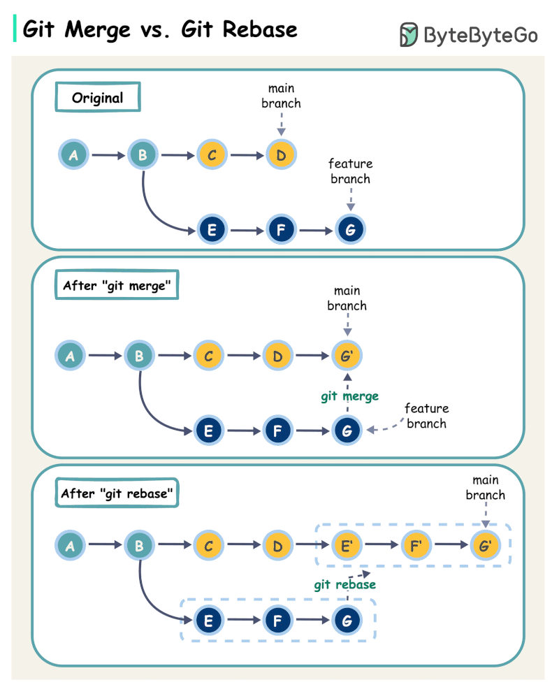

# Git Merge vs. Rebase vs. Squash Commit! 

## What are the differences? 

 
When we 𝐦𝐞𝐫𝐠𝐞 𝐜𝐡𝐚𝐧𝐠𝐞𝐬 from one Git branch to another, we can use ‘git merge’ or ‘git rebase’. The diagram below shows how the two commands work. 
 
### 𝐆𝐢𝐭 𝐌𝐞𝐫𝐠𝐞 
This creates a new commit G’ in the main branch. G’ ties the histories of both main and feature branches. 
 
Git merge is 𝐧𝐨𝐧-𝐝𝐞𝐬𝐭𝐫𝐮𝐜𝐭𝐢𝐯𝐞. Neither the main nor the feature branch is changed. 
 
### 𝐆𝐢𝐭 𝐑𝐞𝐛𝐚𝐬𝐞 
Git rebase moves the feature branch histories to the head of the main branch. It creates new commits E’, F’, and G’ for each commit in the feature branch. 
 
The benefit of rebase is that it has 𝐥𝐢𝐧𝐞𝐚𝐫 𝐜𝐨𝐦𝐦𝐢𝐭 𝐡𝐢𝐬𝐭𝐨𝐫𝐲. 
 
Rebase can be dangerous if “the golden rule of git rebase” is not followed. 
 
### 𝐓𝐡𝐞 𝐆𝐨𝐥𝐝𝐞𝐧 𝐑𝐮𝐥𝐞 𝐨𝐟 𝐆𝐢𝐭 𝐑𝐞𝐛𝐚𝐬𝐞 
Never use it on public branches!
